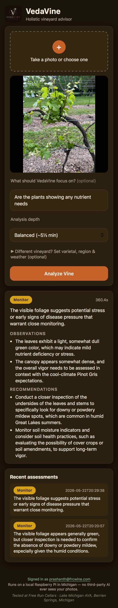

*This is a submission for the [Gemma 4 Challenge](https://dev.to/devteam/join-the-gemma-4-challenge-3000-prize-pool-for-ten-winners-23in) — Build with Gemma 4.*

## What I built

I own **Free Run Cellars**, a 2.5-acre Pinot Gris vineyard in the Lake Michigan AVA. Vineyard problems — powdery mildew, nutrient deficiency, water stress — show up on the leaves days before they show up in the tasting room. The people who can read those signs are expensive, busy, and not standing in my rows at 6am.

So I taught a Raspberry Pi to do it.

**VedaVine** is the result: you snap a photo of a vine, and a structured viticulture assessment comes back — a severity badge, what the model sees, and what to do about it. The twist that matters for this challenge:

> **The entire AI runs on a Raspberry Pi 5 sitting in my vineyard.** Gemma 4 does the diagnosis on-device. No cloud inference, no third-party AI service ever sees my photos.



- 🎬 **16s demo (phone capture):** [demo.mov](demo.mov)
- 💻 **Code:** https://github.com/paispa/vedavine

## Why Gemma 4 — and why *on the Pi*

This challenge's rule is that *Gemma 4 must be doing real work at the heart of the project*. In VedaVine it does the single hardest thing: it **looks at a leaf and reasons about it**. The multimodal assessment — "this chlorosis pattern between the veins reads as magnesium deficiency, not mildew, and here's why" — is Gemma 4 E2B. Nothing else in the stack can be swapped in for that.

I chose **`gemma4:e2b`** specifically because:

1. **It's multimodal and small enough to fit.** It's the variant that gives me real vision-language reasoning while still loading on consumer hardware. There is no sub-7 GB Gemma 4 — `gemma4:e2b` at ~7.7 GB loaded is the floor, and an 8 GB Pi is exactly the floor I wanted to prove out.
2. **It runs fully offline.** A vineyard owner shouldn't have to upload their crop to anyone's servers to get an opinion. On-device Gemma 4 makes "your data stays yours" a property of the architecture, not a promise in a privacy policy.
3. **It produces clean, steerable structured output.** I ask for strict JSON and condition it on the vineyard's varietal, region, and notes; Gemma 4 honors that contract reliably enough to build a UI on top of.

## Architecture

```
 Photo (HEIC/JPEG/PNG)
        │  downscale → 1024px max edge, JPEG q85   (~250 KB)
        ▼
   Flask /analyze ──► build prompt:
        │                • vineyard profile (varietal, region, notes)
        │                • RAG passages  (all-minilm + sqlite-vec)
        │                • local weather (US NWS forecast)
        │                • the grower's typed concern
        ▼
   Ollama @ localhost:11434   ──►  gemma4:e2b  (vision + reasoning, think:false)
        │
        ▼
   defensive JSON parser ──► { severity, summary, observations[], recommendations[] }
        │
        ▼
   browser: severity badge + cited sources
```

Everything above the parser runs on one Raspberry Pi 5. The only outbound calls are an *optional* weather lookup (sends a lat/long, never the photo) and an *optional* Cloudflare tunnel for remote access. Inference itself never leaves the device.

### Gemma 4 isn't working alone — it's grounded

A raw vision model will confidently hallucinate a fungicide schedule. To keep Gemma 4 honest, I feed it two kinds of grounding before it answers:

- **A local viticulture library (RAG).** I embedded ~1,400 chunks from open viticulture sources — Surapala's *Vrikshayurveda*, ATTRA's organic-grape and IPM guides, SARE, the NRCS Soil Biology Primer — into a `sqlite-vec` index with on-device `all-minilm` embeddings. Retrieval is **dynamic**: it's driven by what you actually typed ("yellowing leaf edges — mildew or nutrient?"), so a mildew question pulls the mildew passages and a cover-crop question pulls the cover-crop passages. The cited sources show up under the assessment.
- **Local weather.** It pulls the current US National Weather Service forecast for the vineyard's coordinates and injects humidity/rain context, because disease pressure is a weather story as much as a leaf story.

This is the part I'm proudest of: Gemma 4 isn't a party trick that names a disease. It's the reasoning core of a small expert system that cites its sources and knows it rained yesterday.

## The hard parts (a.k.a. the actually-interesting part)

Running a 7.7 GB multimodal model on an 8 GB Pi is a knife-edge. Here's what it actually took.

### 1. The first inference took 9 minutes. Then ~3.7.

My first real assessment clocked **543 seconds**. CPU-only inference of a 7.7 GB vision model on Pi 5 ARM silicon is just *slow* — there's no GPU offload, `ollama ps` shows `100% CPU`. The single biggest lever turned out to be **`think: false`** in the Ollama payload: disabling the reasoning trace cut the text-generation stage roughly **3×** (251s → 86s), taking the warm baseline from 484s to **~225s** with no measurable loss in JSON quality.

### 2. Grounding doubles latency — and that's a *choice*, not a bug.

When I wired RAG in, latency jumped from ~225s to ~430s at the richest setting. It wasn't model eviction (I confirmed both models stay resident). It's simply that every retrieved passage is more tokens for a CPU to chew through in prompt-eval. So I made it a **user-facing dial**: a *Quick / Balanced / Thorough* depth selector that trades grounding richness for speed. Balanced (k=3, ~322s) is the default. Being honest about the tradeoff *in the UI* felt better than hiding it.

### 3. The embedder that wouldn't fit — and then wouldn't embed.

My first embedder (`nomic-embed-text`, 274 MB) kept getting evicted by Gemma under `OLLAMA_MAX_LOADED_MODELS=2` — they couldn't both stay warm. I swapped to **`all-minilm`** (73 MB loaded), which coexists with Gemma happily.

Then reindexing started throwing `500`s on ~1 in 4 chunks. The culprit: `all-minilm` silently caps around **256 tokens**, and my chunks were longer. The fix was a smaller chunk size (800 chars) plus a **truncate-and-retry** in the embed loop. Final reindex: **1,385 chunks, zero dropped.** Lesson filed under "small models have small mouths."

### 4. Made it shareable without making it a SaaS

A winemaker friend, **Rajat Parr**, farms Pinot Noir on California's Central Coast — totally different climate from my Michigan Pinot Gris. Rather than hardcode my vineyard, I added optional **per-grower context** (varietal / region / ZIP). Drop in a ZIP and it re-points the weather grounding and the system prompt to *that* vineyard. Same Pi, same Gemma, two very different growers — and the photos still never touch a third-party model.

### 5. Cloudflare's 100-second timeout vs. Gemma's 5-minute think

I wanted Rajat to be able to hit `vedavine.app` from California, so the Pi sits behind a Cloudflare Tunnel + Access (email-gated). Great, except: Cloudflare's edge drops HTTP requests at ~100 seconds, and Gemma routinely takes 3–7 minutes. The first remote test came back with *"Invalid response from server"* — the browser was trying to parse Cloudflare's HTML timeout page as JSON.

The fix was structural, not a knob to turn: I made `/analyze` an **async submit**. It validates the upload, kicks off a background thread, and returns a `job_id` instantly. The browser polls `/result/<job_id>` every four seconds. Each individual HTTP hop now finishes in under a second — Cloudflare never sees a slow request — while the Pi gets all the wall-clock it needs. A 12-line change to `app.py` and a 30-line change to the frontend, and remote access went from "broken in production" to "works at any latency."

## Privacy, stated honestly

The defining property is that **the AI runs on my own hardware** — no photo or assessment is ever sent to a third-party model service. Two optional, clearly-scoped exceptions, both off by default: the weather lookup (sends a location, never the image), and a Cloudflare tunnel for remote access (uploads traverse Cloudflare's edge over TLS to reach the Pi, gated to approved emails — but *inference still only happens on the Pi*). I'd rather state that precisely than wave a "nothing ever leaves the device" flag that isn't quite true once you want to use it from the field.

## Try it

```bash
git clone https://github.com/paispa/vedavine.git ~/vedavine
cd ~/vedavine
cp config.yaml.template config.yaml   # vineyard details + a random secret_key
bash setup.sh                          # installs Ollama, pulls gemma4:e2b, systemd unit
# drop viticulture PDFs in corpus/ and: python build_index.py
```

Then open `http://vedavine.local:5000` and photograph a vine.

## What's next

- A second Pi as a dedicated reasoning node so I can keep a vision helper and Gemma both warm and push latency down further.
- Persistent history per vine/block so I can watch a problem progress across a season.
- Post-hoc severity rules (always escalate on "mildew", etc.).

Gemma 4 turned a Raspberry Pi into something that can stand in my vineyard and give me a second opinion — privately, offline, and grounded in real horticultural knowledge. For a small grower, that's not a demo. That's a tool I'll actually use this season.

*Built with Gemma 4 E2B, Ollama, Flask, and `sqlite-vec` on a Raspberry Pi 5. Code: https://github.com/paispa/vedavine*
